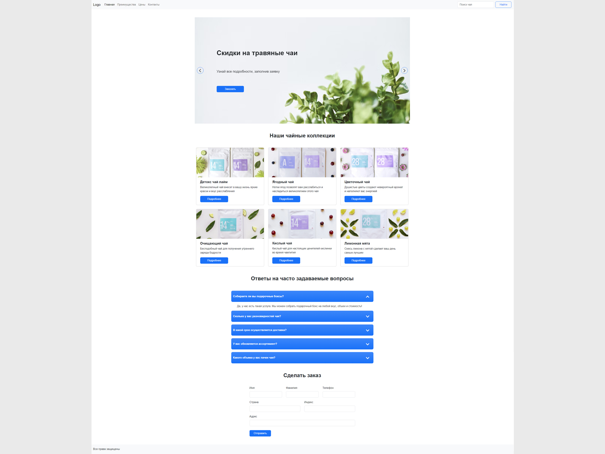

# Страница сайта магазина чая

Самостоятельно выполненный проект в рамках обучения на курсе "Профессия Frontend-Разработчик" в онлайн-школе "Айтилогия".

## Внешний вид

## Выполненные задачи:
- Вёрстка адаптивной веб-страницы магазина чая;
- Практика адаптивной верстки (от 321px);
- Использование Bootstrap, компонентов jQueryUI;
- Практика использования JavaScript для реализации необходимого функционала (обработка событий, изменение структуры DOM-элементов);
- Практика применения библиотек JavaScript (jQueryUi, Slick, Animate.css, wow.js, Magnific Popup).

## Используемые технологии:
* HTML
* CSS + Bootstrap
* JavaScript
* jQuery
* jQueryUi