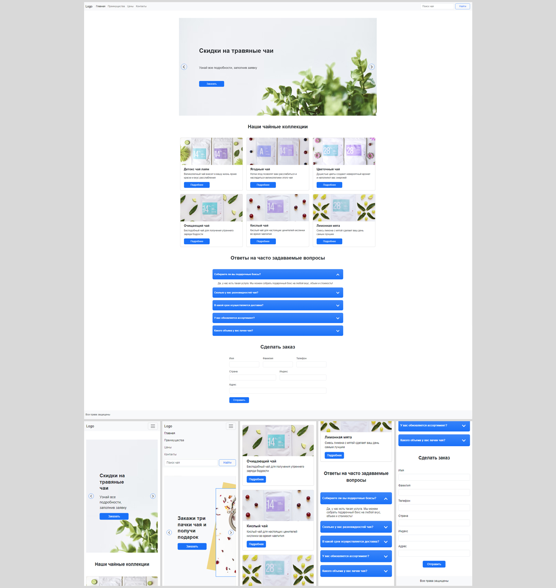

# Страница сайта магазина чая

Вёрстка лендинга магазина чая  
**Год:** 2022

## Внешний вид

## Реализовано:
- Вёрстка адаптивной веб-страницы по макету;
- Адаптив (от 321px);
- Применение Bootstrap, компонентов jQueryUI;
- Реализация функционала (обработка событий, изменение структуры DOM-элементов) с помощью JavaScript.

## Используемые технологии:
* HTML
* CSS + Bootstrap
* JavaScript
* jQuery
* jQueryUi